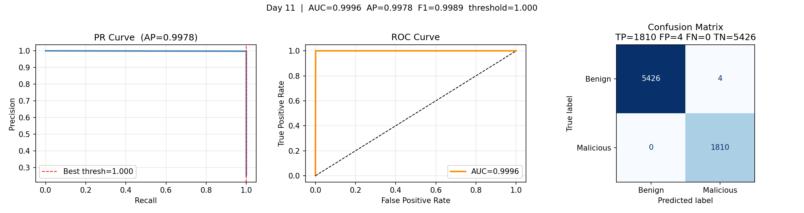
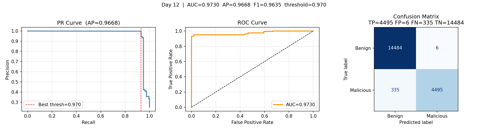

# Graph Anomaly Detection

Edge-level anomaly detection on provenance graphs built from the **DARPA TC CADETS E3** dataset. The system encodes system-call audit logs into heterogeneous graphs and trains a **GINE-based** edge classifier to detect malicious activity.

---

## Dataset — DARPA TC CADETS E3

The dataset spans **April 2–13, 2018** and is stored in a PostgreSQL database (`tc_cadet_dataset_db`). Each row in `event_table` represents a system-call event between two nodes.

| Day | Label | Description |
|-----|-------|-------------|
| 2–5, 7–9 | **BENIGN** | Normal system activity |
| **6** | **ATTACK** | §3.1 Nginx backdoor → Drakon in-memory RAT, netrecon, sshd inject; §4.1 Phishing via postfix |
| **10** | **ATTACK** | §4.1 Phishing e-mail re-routed through CADETS postfix |
| **11** | **ATTACK** | §3.8 Nginx backdoor → Drakon, grain, sshd inject |
| **12** | **ATTACK** | §3.13 Nginx → Drakon, tmux, minions, font, XIM, sendmail, micro APT port scans |
| **13** | **ATTACK** | §3.14 Nginx → Drakon, pEja72mA, eWq10bVcx, eraseme, memhelp.so, done.so |

Ground truth sourced from `TC_Ground_Truth_Report_E3_Update.pdf` (Kudu Dynamics / DARPA TC).

---

## Model — GINEEdgeModel

```
Input: node features x [N, 387],  edge_index [2, E],  edge_relation [E, 7]
                │
      ┌─────────▼──────────┐
      │  GINEConv Layer 1   │  node_in=387 → hidden=128,  edge_dim=7
      │  + ReLU             │
      └─────────┬──────────┘
                │
      ┌─────────▼──────────┐
      │  GINEConv Layer 2   │  hidden=128 → 128,  edge_dim=7
      │  + ReLU             │
      └─────────┬──────────┘
                │
        src_emb ║ dst_emb ║ edge_attr
                │    [hidden*2 + 7 = 263]
      ┌─────────▼──────────┐
      │    Edge MLP         │  263 → 128 → ReLU → Dropout(0.3) → 2
      └─────────┬──────────┘
                │
           logits [E, 2]   →   softmax   →   anomaly score per edge
```

**GINE** (Graph Isomorphism Network with Edge features) extends GIN by injecting edge features at each message-passing step via a linear projection, making it sensitive to edge type — critical for distinguishing attack-related syscall patterns.

---

## Training Procedure

### 1. Edge Balancing
Real attack days have severely imbalanced edges (~1–5% malicious). We subsample benign edges at a configurable ratio:

$$\text{benign\_sample} = \min\left(\lvert\text{malicious}\rvert \times r,\ \lvert\text{benign}\rvert\right)$$

Default `benign ratio = 3` (1 malicious : 3 benign).

### 2. Loss
`CrossEntropyLoss` over per-edge logits.

### 3. Early Stopping
Validation loss is computed on a held-out graph after every epoch. Training halts when val loss does not improve by `min_delta=1e-4` for `patience=10` consecutive epochs. The best checkpoint is saved to `artifact/models/best_model.pt` and reloaded before evaluation.

```
Epoch   0  train_loss=0.68  val_loss=0.65  (patience 0/10)
...
Epoch  23  train_loss=0.31  val_loss=0.39  (patience 10/10)
Early stopping triggered at epoch 23
Loaded best model from epoch 13 (val_loss=0.321)
```

### 4. Threshold Selection
Instead of a fixed 0.5 threshold, the optimal threshold is chosen by sweeping the PR curve and selecting the point that maximises F1:

$$t^* = \arg\max_t \frac{2 \cdot P(t) \cdot R(t)}{P(t) + R(t)}$$

---

## Evaluation Outputs

After training, for each test day the following are saved to `artifact/plots/`:

| Panel | Content |
|-------|---------|
| PR Curve | Precision vs Recall with best-threshold marker (red dashed) and AP score |
| ROC Curve | FPR vs TPR with AUC |
| Confusion Matrix | TP / FP / FN / TN with class labels |

### Day 11 — Attack Day (Nginx → Drakon, sshd inject)



### Day 12 — Attack Day (Nginx → Drakon, Micro APT port scans)



Console output per test day:
```
Day 11 → AUC: 0.9996, F1: 0.9989, best threshold: 1.000
Day 11 → TP=1810  FP=4  FN=0  TN=5426
Saved analysis plot to ./artifact/plots/analysis_day11.png
```

---


## Setup

### Prerequisites
- Python 3.10
- CUDA-capable GPU (tested on RTX 3090)
- PostgreSQL with `tc_cadet_dataset_db` loaded
- Conda environment

### Installation

```bash
conda create -n kairos python=3.10
conda activate kairos

# Install PyTorch with CUDA
pip install torch==2.5.1 torchvision==0.20.1 torchaudio==2.5.1 \
    --index-url https://download.pytorch.org/whl/cu124

# Install remaining dependencies
pip install -r requirements.txt

# Fix MKL version conflict (if OpenBLAS warnings appear)
conda install "mkl<2025" "intel-openmp<2025" -y
```

---

## Running

### Step 1 — Build graphs
```bash
python3 build_graphs.py
```
Connects to PostgreSQL, encodes 268k node texts with MiniLM, builds one PyG graph per day (days 2–13), saves to `artifact/graphs/`.

> First run downloads `all-MiniLM-L6-v2` (~90MB) and caches embeddings to `artifact/node_embeddings.pt`. Subsequent runs load from cache.

### Step 2 — Train and evaluate
```bash
python3 train_test.py
```
Trains `GINEEdgeModel`, applies early stopping, evaluates on test days, saves plots to `artifact/plots/`.

### Configuration
Edit [`config.py`](config.py) to change:

| Parameter | Default | Description |
|-----------|---------|-------------|
| `train_days` | `[6, 10]` | Days used for training |
| `test_days` | `[11, 12]` | Days used for evaluation |
| `epochs` | `100` | Max training epochs |
| `benign_ratio` | `3` | Benign:malicious edge sampling ratio |

---

## Citation / Acknowledgements

Dataset: DARPA Transparent Computing (TC) Program — CADETS E3  
Ground truth: `TC_Ground_Truth_Report_E3_Update.pdf`, Kudu Dynamics     
Kairos: [`Kairos-GitHub`](https://github.com/ubc-provenance/kairos)